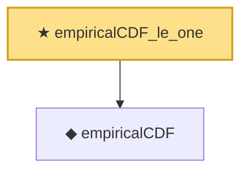

# Proof narrative — empiricalCDF_le_one

Root: **empiricalCDF_le_one** (theorem) `Statlib/Bootstrap/empiricalCDF_le_one.lean:11` · topic `Bootstrap`
Closure: 2 declarations across 2 files. Generated from `proof_graph.json` — no files were moved.

Reading order (foundations first, headline last):

  ◆ `empiricalCDF` — noncomputable def · `Statlib/Bootstrap/empiricalCDF.lean:11`  _(also used by 4: empiricalCDF_eq_one_of_max_le, empiricalCDF_eq_zero_of_lt_min, empiricalCDF_monotone, …)_
★ `empiricalCDF_le_one` — theorem · `Statlib/Bootstrap/empiricalCDF_le_one.lean:11` **← headline**

## Dependency diagram

