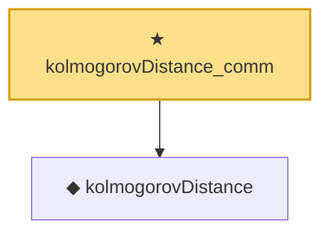

# Proof narrative — kolmogorovDistance_comm

Root: **kolmogorovDistance_comm** (theorem) `Statlib/Bootstrap/kolmogorovDistance_comm.lean:11` · topic `Bootstrap`
Closure: 2 declarations across 2 files. Generated from `proof_graph.json` — no files were moved.

Reading order (foundations first, headline last):

  ◆ `kolmogorovDistance` — noncomputable def · `Statlib/Bootstrap/kolmogorovDistance.lean:11`
★ `kolmogorovDistance_comm` — theorem · `Statlib/Bootstrap/kolmogorovDistance_comm.lean:11` **← headline**

## Dependency diagram

