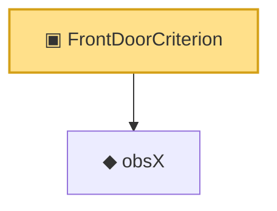

# Proof narrative — FrontDoorCriterion

Root: **FrontDoorCriterion** (structure) `Statlib/Causal/SCM/FrontdoorCriterion.lean:103` · topic `Causal`
Closure: 2 declarations across 1 files. Generated from `proof_graph.json` — no files were moved.

Reading order (foundations first, headline last):

  ◆ `obsX` — noncomputable def · `Statlib/Causal/SCM/FrontdoorCriterion.lean:52`
▣ `FrontDoorCriterion` — structure · `Statlib/Causal/SCM/FrontdoorCriterion.lean:103` **← headline**

## Dependency diagram

