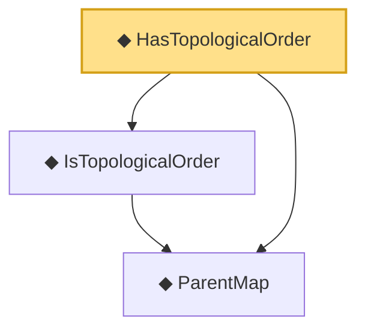

# Proof narrative — HasTopologicalOrder

Root: **HasTopologicalOrder** (def) `Statlib/Causal/SCM/Vocabulary.lean:51` · topic `Causal`
Closure: 3 declarations across 1 files. Generated from `proof_graph.json` — no files were moved.

Reading order (foundations first, headline last):

  ◆ `ParentMap` — abbrev · `Statlib/Causal/SCM/Vocabulary.lean:36`  _(also used by 44: parentsIn, mem_parentsIn_iff, DependsOnlyOnParents, …)_
  ◆ `IsTopologicalOrder` — def · `Statlib/Causal/SCM/Vocabulary.lean:47`  _(also used by 1: acyclic_of_topological_order)_
◆ `HasTopologicalOrder` — def · `Statlib/Causal/SCM/Vocabulary.lean:51` **← headline**

## Dependency diagram

