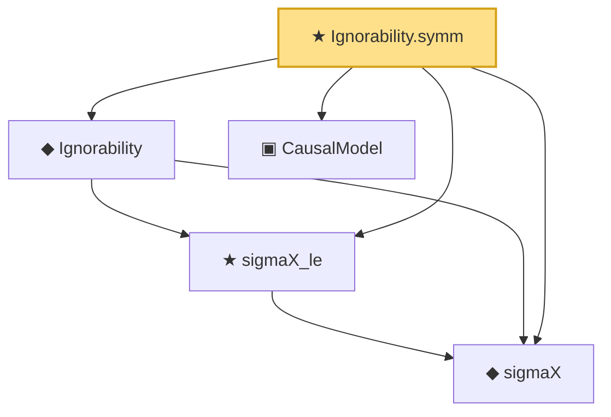

# Proof narrative — Ignorability.symm

Root: **Ignorability.symm** (theorem) `Statlib/Causal/Basic.lean:129` · topic `Causal`
Closure: 5 declarations across 1 files. Generated from `proof_graph.json` — no files were moved.

Reading order (foundations first, headline last):

  ◆ `sigmaX` — def · `Statlib/Causal/Basic.lean:61`  _(also used by 1: propensityScore)_
  ★ `sigmaX_le` — theorem · `Statlib/Causal/Basic.lean:65`
  ◆ `Ignorability` — def · `Statlib/Causal/Basic.lean:75`  _(also used by 1: causalEffectMap_identification)_
  ▣ `CausalModel` — structure · `Statlib/Causal/Basic.lean:32`  _(also used by 1: causalEffectMap_identification)_
★ `Ignorability.symm` — theorem · `Statlib/Causal/Basic.lean:129` **← headline**

## Dependency diagram

