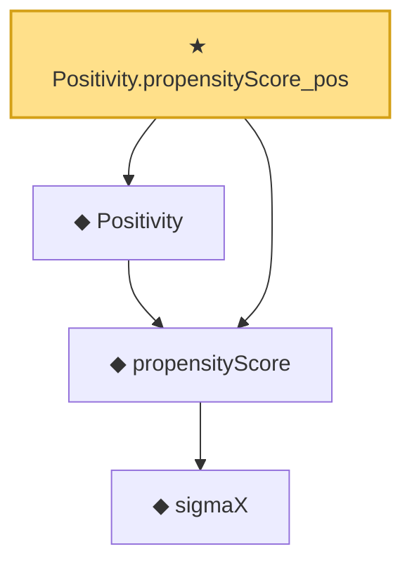

# Proof narrative — Positivity.propensityScore_pos

Root: **Positivity.propensityScore_pos** (theorem) `Statlib/Causal/Basic.lean:100` · topic `Causal`
Closure: 4 declarations across 1 files. Generated from `proof_graph.json` — no files were moved.

Reading order (foundations first, headline last):

      ◆ `sigmaX` — def · `Statlib/Causal/Basic.lean:61`  _(also used by 3: sigmaX_le, Ignorability, Ignorability.symm)_
  ◆ `propensityScore` — noncomputable def · `Statlib/Causal/Basic.lean:86`  _(also used by 4: Positivity.propensityScore_lt_one, causalEffectMap_identification, doublyRobustEstimatingFunction, …)_
  ◆ `Positivity` — def · `Statlib/Causal/Basic.lean:95`  _(also used by 2: Positivity.propensityScore_lt_one, causalEffectMap_identification)_
★ `Positivity.propensityScore_pos` — theorem · `Statlib/Causal/Basic.lean:100` **← headline**

## Dependency diagram

