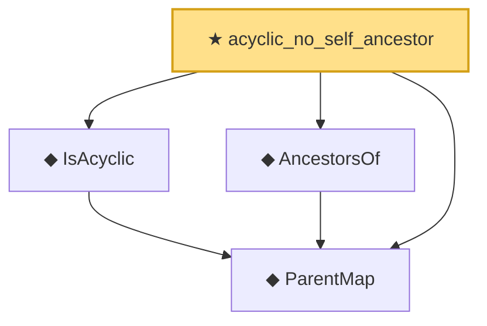

# Proof narrative — acyclic_no_self_ancestor

Root: **acyclic_no_self_ancestor** (theorem) `Statlib/Causal/SCM/Theorems.lean:400` · topic `Causal`
Closure: 4 declarations across 3 files. Generated from `proof_graph.json` — no files were moved.

Reading order (foundations first, headline last):

  ◆ `ParentMap` — abbrev · `Statlib/Causal/SCM/Vocabulary.lean:36`  _(also used by 43: parentsIn, mem_parentsIn_iff, DependsOnlyOnParents, …)_
  ◆ `IsAcyclic` — def · `Statlib/Causal/SCM/Vocabulary.lean:42`  _(also used by 6: acyclic_of_topological_order, acyclic_no_self_loop, ancestor_moralize_reachable, …)_
  ◆ `AncestorsOf` — def · `Statlib/Causal/SCM/GFormulaGraph.lean:90`  _(also used by 7: ancestors_strictly_below, parent_mem_ancestors, ancestor_trans, …)_
★ `acyclic_no_self_ancestor` — theorem · `Statlib/Causal/SCM/Theorems.lean:400` **← headline**

## Dependency diagram

