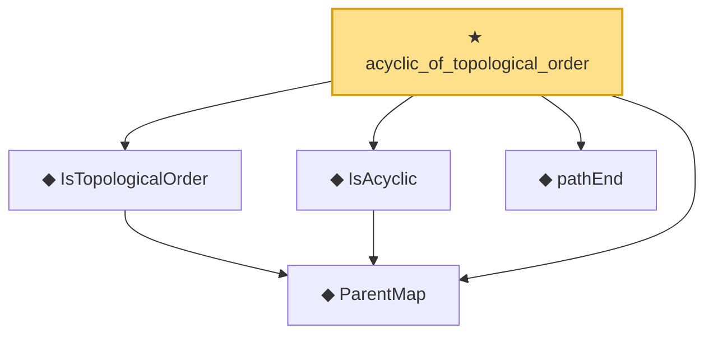

# Proof narrative — acyclic_of_topological_order

Root: **acyclic_of_topological_order** (theorem) `Statlib/Causal/SCM/Theorems.lean:46` · topic `Causal`
Closure: 5 declarations across 2 files. Generated from `proof_graph.json` — no files were moved.

Reading order (foundations first, headline last):

  ◆ `ParentMap` — abbrev · `Statlib/Causal/SCM/Vocabulary.lean:36`  _(also used by 43: parentsIn, mem_parentsIn_iff, DependsOnlyOnParents, …)_
  ◆ `IsTopologicalOrder` — def · `Statlib/Causal/SCM/Vocabulary.lean:47`  _(also used by 1: HasTopologicalOrder)_
  ◆ `IsAcyclic` — def · `Statlib/Causal/SCM/Vocabulary.lean:42`  _(also used by 6: acyclic_no_self_loop, acyclic_no_self_ancestor, ancestor_moralize_reachable, …)_
  ◆ `pathEnd` — def · `Statlib/Causal/SCM/Vocabulary.lean:39`
★ `acyclic_of_topological_order` — theorem · `Statlib/Causal/SCM/Theorems.lean:46` **← headline**

## Dependency diagram

