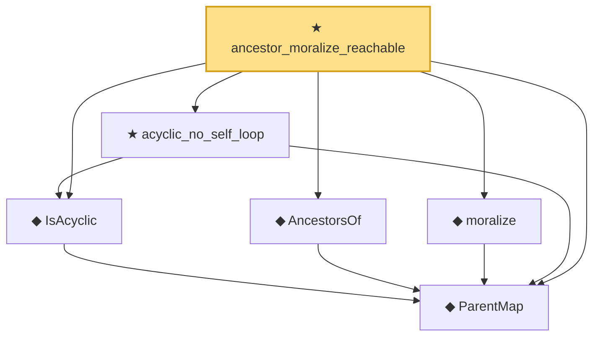

# Proof narrative — ancestor_moralize_reachable

Root: **ancestor_moralize_reachable** (theorem) `Statlib/Causal/SCM/Theorems.lean:1390` · topic `Causal`
Closure: 6 declarations across 4 files. Generated from `proof_graph.json` — no files were moved.

Reading order (foundations first, headline last):

  ◆ `ParentMap` — abbrev · `Statlib/Causal/SCM/Vocabulary.lean:36`  _(also used by 41: parentsIn, mem_parentsIn_iff, DependsOnlyOnParents, …)_
  ◆ `IsAcyclic` — def · `Statlib/Causal/SCM/Vocabulary.lean:42`  _(also used by 5: acyclic_of_topological_order, acyclic_no_self_ancestor, backdoor_blocks_into_x_of_parents_subset, …)_
  ◆ `AncestorsOf` — def · `Statlib/Causal/SCM/GFormulaGraph.lean:90`  _(also used by 7: acyclic_no_self_ancestor, ancestors_strictly_below, parent_mem_ancestors, …)_
  ◆ `moralize` — def · `Statlib/Causal/SCM/MoralizedGraph.lean:60`  _(also used by 4: moralize_adj_iff, parent_edge_moralized, skeleton_edge_moralized, …)_
  ★ `acyclic_no_self_loop` — theorem · `Statlib/Causal/SCM/Theorems.lean:64`
★ `ancestor_moralize_reachable` — theorem · `Statlib/Causal/SCM/Theorems.lean:1390` **← headline**

## Dependency diagram

