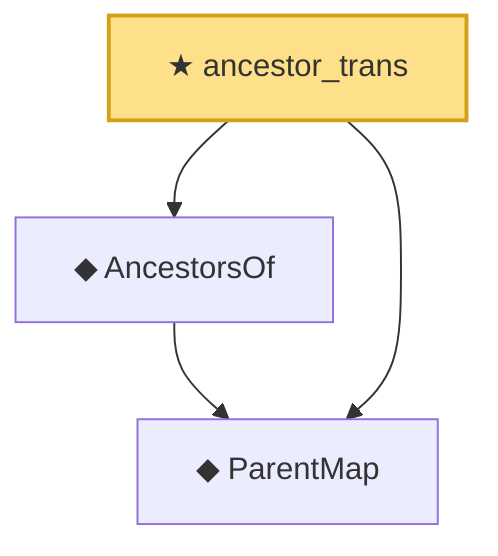

# Proof narrative — ancestor_trans

Root: **ancestor_trans** (theorem) `Statlib/Causal/SCM/Theorems.lean:669` · topic `Causal`
Closure: 3 declarations across 3 files. Generated from `proof_graph.json` — no files were moved.

Reading order (foundations first, headline last):

  ◆ `ParentMap` — abbrev · `Statlib/Causal/SCM/Vocabulary.lean:36`  _(also used by 44: parentsIn, mem_parentsIn_iff, DependsOnlyOnParents, …)_
  ◆ `AncestorsOf` — def · `Statlib/Causal/SCM/GFormulaGraph.lean:90`  _(also used by 7: acyclic_no_self_ancestor, ancestors_strictly_below, parent_mem_ancestors, …)_
★ `ancestor_trans` — theorem · `Statlib/Causal/SCM/Theorems.lean:669` **← headline**

## Dependency diagram

