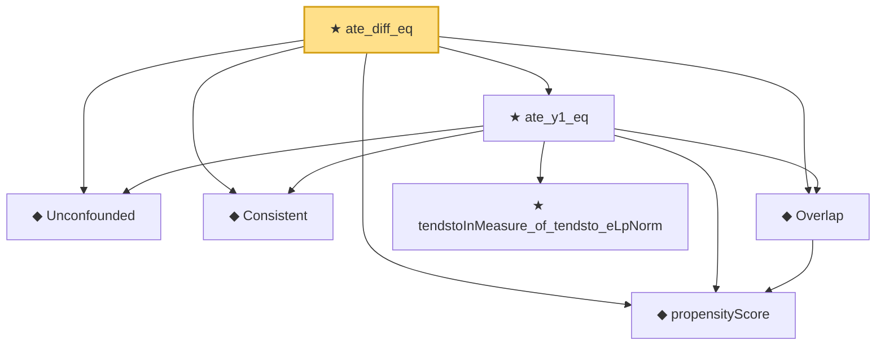

# Proof narrative — ate_diff_eq

Root: **ate_diff_eq** (theorem) `Statlib/Causal/Identification.lean:1076` · topic `Causal`
Closure: 7 declarations across 3 files. Generated from `proof_graph.json` — no files were moved.

Reading order (foundations first, headline last):

  ◆ `Unconfounded` — def · `Statlib/Causal/Vocabulary.lean:38`  _(also used by 2: condIndep_of_unconfounded_by_propensity, ate_y1_eq_by_propensity)_
  ◆ `Consistent` — def · `Statlib/Causal/Vocabulary.lean:44`  _(also used by 2: obs_eq_potential_outcome_of_T, ate_y1_eq_by_propensity)_
  ◆ `propensityScore` — noncomputable def · `Statlib/Causal/Vocabulary.lean:31`  _(also used by 3: condIndep_of_unconfounded_by_propensity, ate_y1_eq_by_propensity, condExp_mul_indicator_eq_mul_condExp_of_condIndep)_
  ◆ `Overlap` — def · `Statlib/Causal/Vocabulary.lean:49`  _(also used by 1: ate_y1_eq_by_propensity)_
    ★ `tendstoInMeasure_of_tendsto_eLpNorm` — theorem · `Statlib/StatFoundation/Convergence/AnalysisTools/ConvergenceModes.lean:976`  _(also used by 3: condExp_mul_indicator_eq_mul_condExp_of_condIndep, tendstoInMeasure_of_inLpConvergence, inProbabilityConvergence_of_tendsto_eLpNorm)_
  ★ `ate_y1_eq` — theorem · `Statlib/Causal/Identification.lean:65`  _(also used by 1: ate_y1_eq_by_propensity)_
★ `ate_diff_eq` — theorem · `Statlib/Causal/Identification.lean:1076` **← headline**

## Dependency diagram

