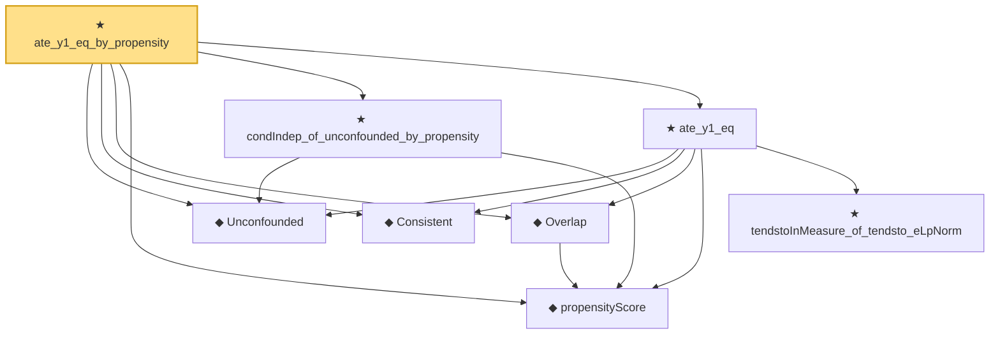

# Proof narrative — ate_y1_eq_by_propensity

Root: **ate_y1_eq_by_propensity** (theorem) `Statlib/Causal/Identification.lean:1718` · topic `Causal`
Closure: 8 declarations across 3 files. Generated from `proof_graph.json` — no files were moved.

Reading order (foundations first, headline last):

  ◆ `Unconfounded` — def · `Statlib/Causal/Vocabulary.lean:38`  _(also used by 1: ate_diff_eq)_
  ◆ `Consistent` — def · `Statlib/Causal/Vocabulary.lean:44`  _(also used by 2: obs_eq_potential_outcome_of_T, ate_diff_eq)_
  ◆ `propensityScore` — noncomputable def · `Statlib/Causal/Vocabulary.lean:31`  _(also used by 2: ate_diff_eq, condExp_mul_indicator_eq_mul_condExp_of_condIndep)_
  ◆ `Overlap` — def · `Statlib/Causal/Vocabulary.lean:49`  _(also used by 1: ate_diff_eq)_
  ★ `condIndep_of_unconfounded_by_propensity` — theorem · `Statlib/Causal/Identification.lean:788`
    ★ `tendstoInMeasure_of_tendsto_eLpNorm` — theorem · `Statlib/StatFoundation/Convergence/AnalysisTools/ConvergenceModes.lean:976`  _(also used by 3: condExp_mul_indicator_eq_mul_condExp_of_condIndep, tendstoInMeasure_of_inLpConvergence, inProbabilityConvergence_of_tendsto_eLpNorm)_
  ★ `ate_y1_eq` — theorem · `Statlib/Causal/Identification.lean:65`  _(also used by 1: ate_diff_eq)_
★ `ate_y1_eq_by_propensity` — theorem · `Statlib/Causal/Identification.lean:1718` **← headline**

## Dependency diagram

