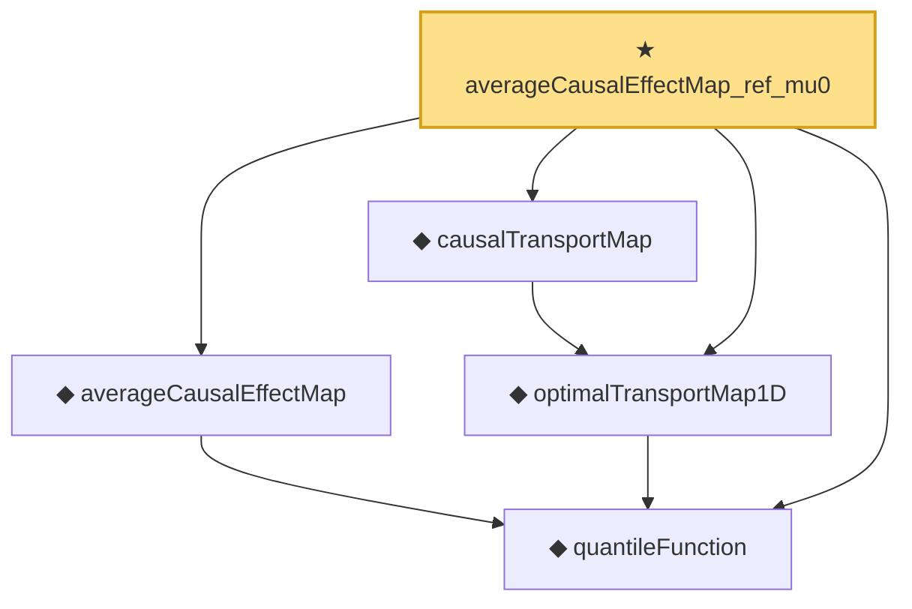

# Proof narrative — averageCausalEffectMap_ref_mu0

Root: **averageCausalEffectMap_ref_mu0** (theorem) `Statlib/Causal/OptimalTransport.lean:299` · topic `Causal`
Closure: 5 declarations across 1 files. Generated from `proof_graph.json` — no files were moved.

Reading order (foundations first, headline last):

  ◆ `quantileFunction` — noncomputable def · `Statlib/Causal/OptimalTransport.lean:34`  _(also used by 16: quantileFunction_mono, quantileFunction_le_of_le_cdf, le_cdf_of_quantileFunction_le, …)_
  ◆ `averageCausalEffectMap` — noncomputable def · `Statlib/Causal/OptimalTransport.lean:269`  _(also used by 6: averageCausalEffectMap_eq_quantile_diff, averageCausalEffectMap_eq_zero_of_eq, causalEffectMap_uniform_eq_qte, …)_
  ◆ `optimalTransportMap1D` — noncomputable def · `Statlib/Causal/OptimalTransport.lean:136`  _(also used by 1: optimal_transport_map_injective)_
  ◆ `causalTransportMap` — noncomputable def · `Statlib/Causal/OptimalTransport.lean:292`
★ `averageCausalEffectMap_ref_mu0` — theorem · `Statlib/Causal/OptimalTransport.lean:299` **← headline**

## Dependency diagram

