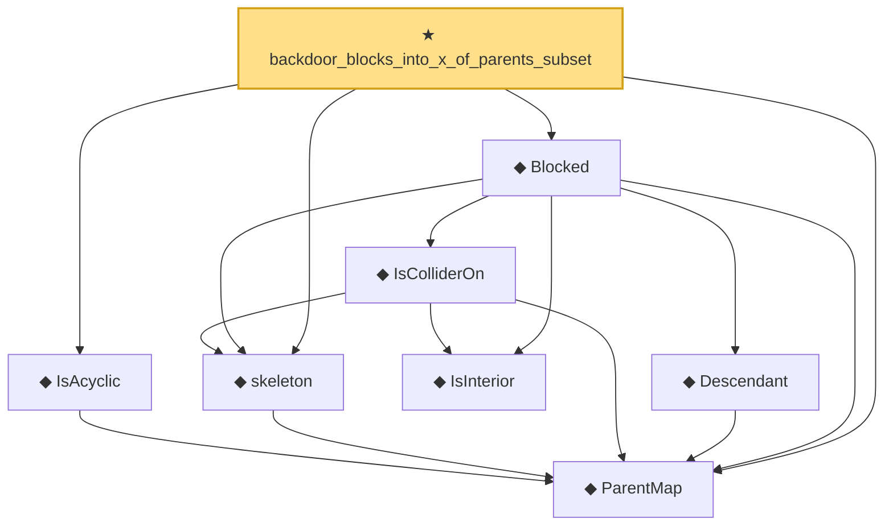

# Proof narrative — backdoor_blocks_into_x_of_parents_subset

Root: **backdoor_blocks_into_x_of_parents_subset** (theorem) `Statlib/Causal/SCM/Theorems.lean:1528` · topic `Causal`
Closure: 8 declarations across 3 files. Generated from `proof_graph.json` — no files were moved.

Reading order (foundations first, headline last):

  ◆ `ParentMap` — abbrev · `Statlib/Causal/SCM/Vocabulary.lean:36`  _(also used by 40: parentsIn, mem_parentsIn_iff, DependsOnlyOnParents, …)_
  ◆ `IsAcyclic` — def · `Statlib/Causal/SCM/Vocabulary.lean:42`  _(also used by 6: acyclic_of_topological_order, acyclic_no_self_loop, acyclic_no_self_ancestor, …)_
  ◆ `skeleton` — def · `Statlib/Causal/SCM/MoralizedGraph.lean:45`  _(also used by 11: DSeparated, BackDoorCriterion, skeleton_adj_iff, …)_
    ◆ `IsInterior` — def · `Statlib/Causal/SCM/MoralizedGraph.lean:87`  _(also used by 6: IsInterior_reverse, getVert_rev_eq, getVert_rev_left_eq, …)_
    ◆ `IsColliderOn` — def · `Statlib/Causal/SCM/MoralizedGraph.lean:93`  _(also used by 3: collider_of_reverse, not_collider_of_reverse, blocked_reverse)_
    ◆ `Descendant` — def · `Statlib/Causal/SCM/MoralizedGraph.lean:79`  _(also used by 4: BackDoorCriterion, descendant_rev_ancestor, blocked_reverse, …)_
  ◆ `Blocked` — def · `Statlib/Causal/SCM/MoralizedGraph.lean:103`  _(also used by 5: DSeparated, BackDoorCriterion, blocked_reverse, …)_
★ `backdoor_blocks_into_x_of_parents_subset` — theorem · `Statlib/Causal/SCM/Theorems.lean:1528` **← headline**

## Dependency diagram

