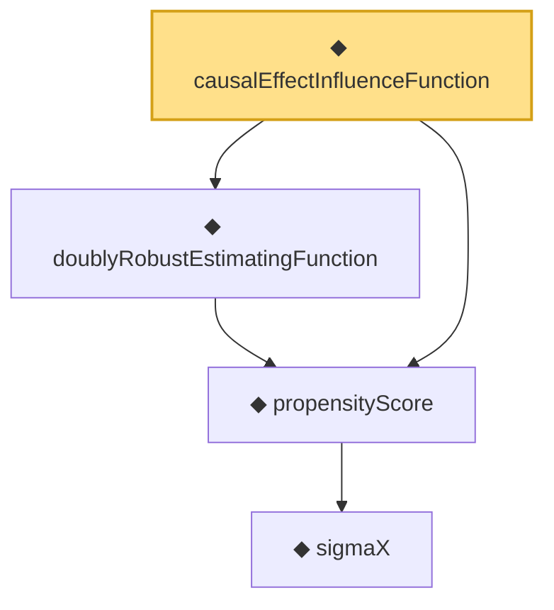

# Proof narrative — causalEffectInfluenceFunction

Root: **causalEffectInfluenceFunction** (noncomputable def) `Statlib/Causal/OptimalTransport.lean:589` · topic `Causal`
Closure: 4 declarations across 2 files. Generated from `proof_graph.json` — no files were moved.

Reading order (foundations first, headline last):

    ◆ `sigmaX` — def · `Statlib/Causal/Basic.lean:61`  _(also used by 3: sigmaX_le, Ignorability, Ignorability.symm)_
  ◆ `propensityScore` — noncomputable def · `Statlib/Causal/Basic.lean:86`  _(also used by 4: Positivity, Positivity.propensityScore_pos, Positivity.propensityScore_lt_one, …)_
  ◆ `doublyRobustEstimatingFunction` — noncomputable def · `Statlib/Causal/OptimalTransport.lean:570`
◆ `causalEffectInfluenceFunction` — noncomputable def · `Statlib/Causal/OptimalTransport.lean:589` **← headline**

## Dependency diagram

