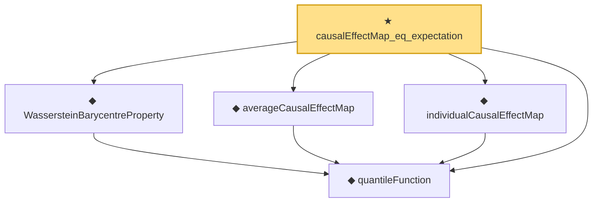

# Proof narrative — causalEffectMap_eq_expectation

Root: **causalEffectMap_eq_expectation** (theorem) `Statlib/Causal/OptimalTransport.lean:423` · topic `Causal`
Closure: 5 declarations across 1 files. Generated from `proof_graph.json` — no files were moved.

Reading order (foundations first, headline last):

  ◆ `quantileFunction` — noncomputable def · `Statlib/Causal/OptimalTransport.lean:34`  _(also used by 15: quantileFunction_mono, quantileFunction_le_of_le_cdf, le_cdf_of_quantileFunction_le, …)_
  ◆ `WassersteinBarycentreProperty` — def · `Statlib/Causal/OptimalTransport.lean:367`  _(also used by 2: wassersteinBarycentreProperty_of_pointwise_mean, causalEffectMap_identification)_
  ◆ `averageCausalEffectMap` — noncomputable def · `Statlib/Causal/OptimalTransport.lean:269`  _(also used by 6: averageCausalEffectMap_eq_quantile_diff, averageCausalEffectMap_eq_zero_of_eq, averageCausalEffectMap_ref_mu0, …)_
  ◆ `individualCausalEffectMap` — noncomputable def · `Statlib/Causal/OptimalTransport.lean:258`
★ `causalEffectMap_eq_expectation` — theorem · `Statlib/Causal/OptimalTransport.lean:423` **← headline**

## Dependency diagram

