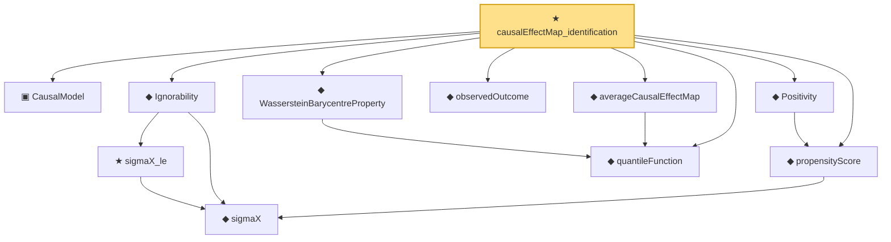

# Proof narrative — causalEffectMap_identification

Root: **causalEffectMap_identification** (theorem) `Statlib/Causal/OptimalTransport.lean:482` · topic `Causal`
Closure: 11 declarations across 2 files. Generated from `proof_graph.json` — no files were moved.

Reading order (foundations first, headline last):

  ▣ `CausalModel` — structure · `Statlib/Causal/Basic.lean:32`  _(also used by 1: Ignorability.symm)_
    ◆ `sigmaX` — def · `Statlib/Causal/Basic.lean:61`  _(also used by 1: Ignorability.symm)_
    ★ `sigmaX_le` — theorem · `Statlib/Causal/Basic.lean:65`  _(also used by 1: Ignorability.symm)_
  ◆ `Ignorability` — def · `Statlib/Causal/Basic.lean:75`  _(also used by 1: Ignorability.symm)_
  ◆ `propensityScore` — noncomputable def · `Statlib/Causal/Basic.lean:86`  _(also used by 4: Positivity.propensityScore_pos, Positivity.propensityScore_lt_one, doublyRobustEstimatingFunction, …)_
  ◆ `Positivity` — def · `Statlib/Causal/Basic.lean:95`  _(also used by 2: Positivity.propensityScore_pos, Positivity.propensityScore_lt_one)_
  ◆ `observedOutcome` — def · `Statlib/Causal/Basic.lean:117`  _(also used by 1: sutva)_
  ◆ `quantileFunction` — noncomputable def · `Statlib/Causal/OptimalTransport.lean:34`  _(also used by 16: quantileFunction_mono, quantileFunction_le_of_le_cdf, le_cdf_of_quantileFunction_le, …)_
  ◆ `WassersteinBarycentreProperty` — def · `Statlib/Causal/OptimalTransport.lean:367`  _(also used by 2: wassersteinBarycentreProperty_of_pointwise_mean, causalEffectMap_eq_expectation)_
  ◆ `averageCausalEffectMap` — noncomputable def · `Statlib/Causal/OptimalTransport.lean:269`  _(also used by 6: averageCausalEffectMap_eq_quantile_diff, averageCausalEffectMap_eq_zero_of_eq, averageCausalEffectMap_ref_mu0, …)_
★ `causalEffectMap_identification` — theorem · `Statlib/Causal/OptimalTransport.lean:482` **← headline**

## Dependency diagram

