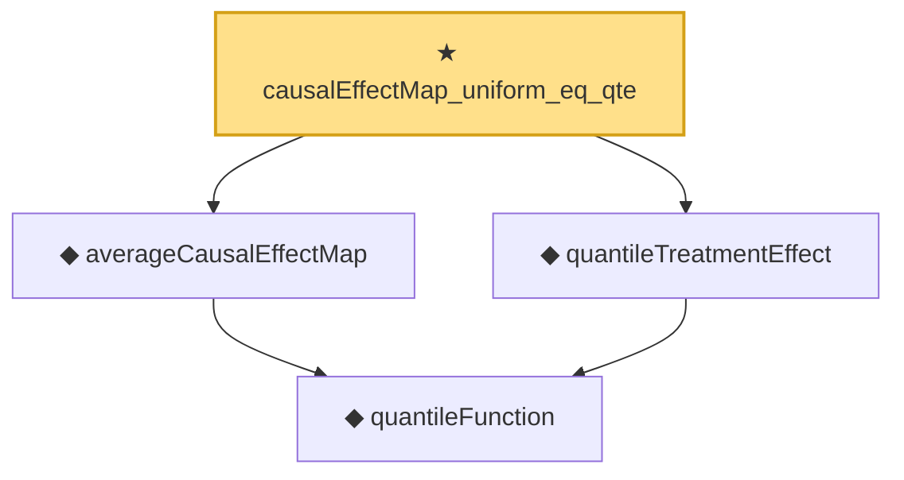

# Proof narrative — causalEffectMap_uniform_eq_qte

Root: **causalEffectMap_uniform_eq_qte** (theorem) `Statlib/Causal/OptimalTransport.lean:342` · topic `Causal`
Closure: 4 declarations across 1 files. Generated from `proof_graph.json` — no files were moved.

Reading order (foundations first, headline last):

    ◆ `quantileFunction` — noncomputable def · `Statlib/Causal/OptimalTransport.lean:34`  _(also used by 17: quantileFunction_mono, quantileFunction_le_of_le_cdf, le_cdf_of_quantileFunction_le, …)_
  ◆ `averageCausalEffectMap` — noncomputable def · `Statlib/Causal/OptimalTransport.lean:269`  _(also used by 6: averageCausalEffectMap_eq_quantile_diff, averageCausalEffectMap_eq_zero_of_eq, averageCausalEffectMap_ref_mu0, …)_
  ◆ `quantileTreatmentEffect` — noncomputable def · `Statlib/Causal/OptimalTransport.lean:327`
★ `causalEffectMap_uniform_eq_qte` — theorem · `Statlib/Causal/OptimalTransport.lean:342` **← headline**

## Dependency diagram

