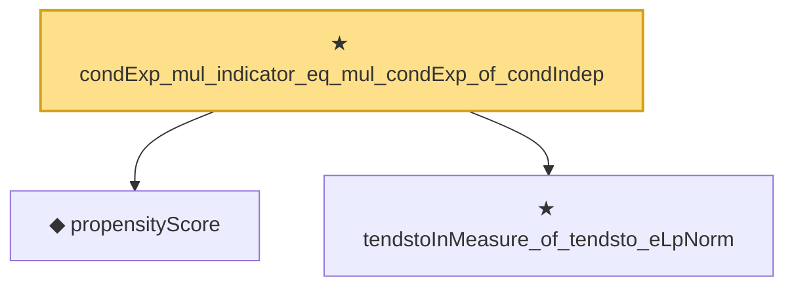

# Proof narrative — condExp_mul_indicator_eq_mul_condExp_of_condIndep

Root: **condExp_mul_indicator_eq_mul_condExp_of_condIndep** (theorem) `Statlib/Causal/Identification.lean:1816` · topic `Causal`
Closure: 3 declarations across 3 files. Generated from `proof_graph.json` — no files were moved.

Reading order (foundations first, headline last):

  ◆ `propensityScore` — noncomputable def · `Statlib/Causal/Vocabulary.lean:31`  _(also used by 5: ate_y1_eq, condIndep_of_unconfounded_by_propensity, ate_diff_eq, …)_
  ★ `tendstoInMeasure_of_tendsto_eLpNorm` — theorem · `Statlib/StatFoundation/Convergence/AnalysisTools/ConvergenceModes.lean:976`  _(also used by 3: ate_y1_eq, tendstoInMeasure_of_inLpConvergence, inProbabilityConvergence_of_tendsto_eLpNorm)_
★ `condExp_mul_indicator_eq_mul_condExp_of_condIndep` — theorem · `Statlib/Causal/Identification.lean:1816` **← headline**

## Dependency diagram

