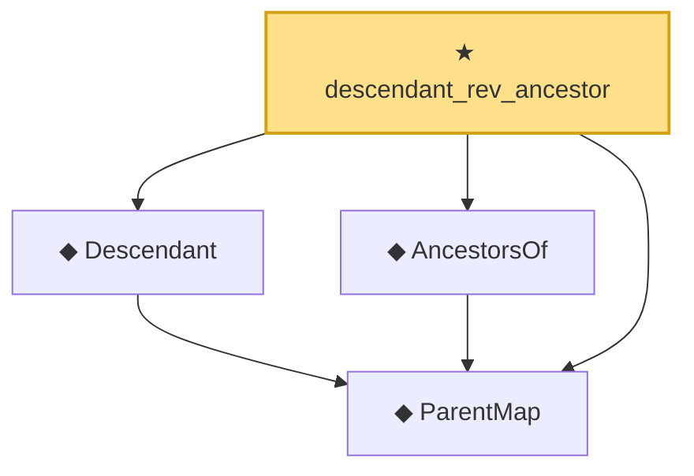

# Proof narrative — descendant_rev_ancestor

Root: **descendant_rev_ancestor** (theorem) `Statlib/Causal/SCM/Theorems.lean:1383` · topic `Causal`
Closure: 4 declarations across 4 files. Generated from `proof_graph.json` — no files were moved.

Reading order (foundations first, headline last):

  ◆ `ParentMap` — abbrev · `Statlib/Causal/SCM/Vocabulary.lean:36`  _(also used by 43: parentsIn, mem_parentsIn_iff, DependsOnlyOnParents, …)_
  ◆ `Descendant` — def · `Statlib/Causal/SCM/MoralizedGraph.lean:79`  _(also used by 4: Blocked, BackDoorCriterion, blocked_reverse, …)_
  ◆ `AncestorsOf` — def · `Statlib/Causal/SCM/GFormulaGraph.lean:90`  _(also used by 7: acyclic_no_self_ancestor, ancestors_strictly_below, parent_mem_ancestors, …)_
★ `descendant_rev_ancestor` — theorem · `Statlib/Causal/SCM/Theorems.lean:1383` **← headline**

## Dependency diagram

