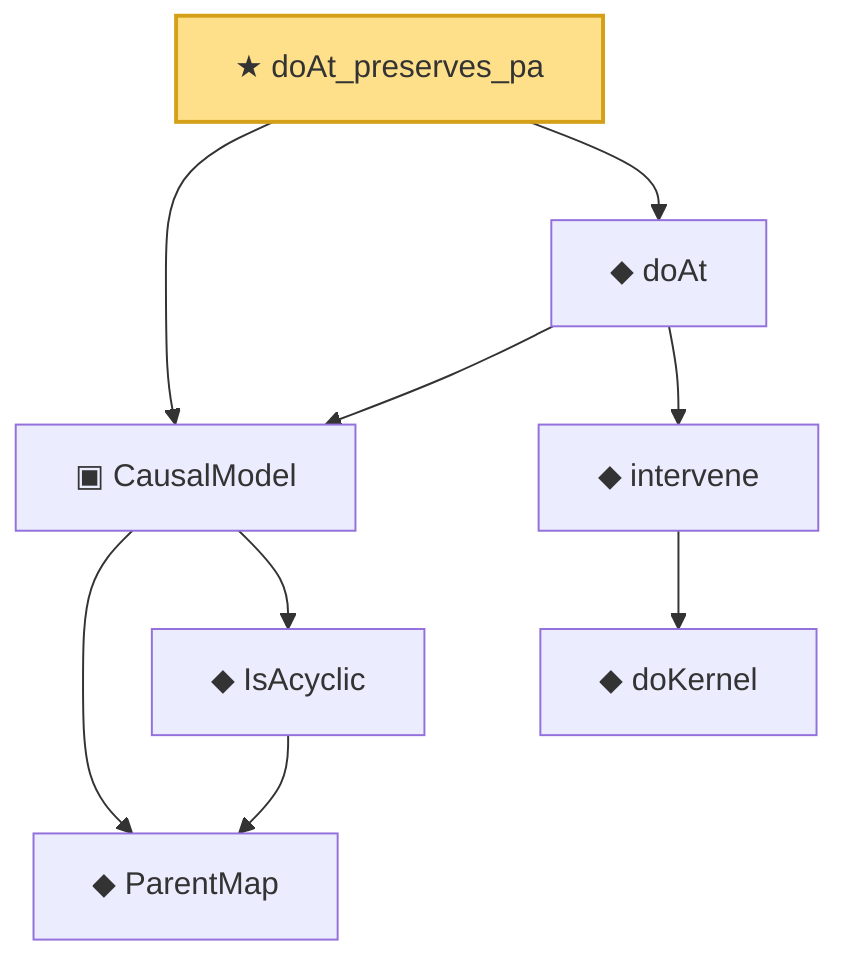

# Proof narrative — doAt_preserves_pa

Root: **doAt_preserves_pa** (theorem) `Statlib/Causal/SCM/Theorems.lean:96` · topic `Causal`
Closure: 7 declarations across 2 files. Generated from `proof_graph.json` — no files were moved.

Reading order (foundations first, headline last):

    ◆ `ParentMap` — abbrev · `Statlib/Causal/SCM/Vocabulary.lean:36`  _(also used by 44: parentsIn, mem_parentsIn_iff, DependsOnlyOnParents, …)_
    ◆ `IsAcyclic` — def · `Statlib/Causal/SCM/Vocabulary.lean:42`  _(also used by 6: acyclic_of_topological_order, acyclic_no_self_loop, acyclic_no_self_ancestor, …)_
  ▣ `CausalModel` — structure · `Statlib/Causal/SCM/Vocabulary.lean:76`  _(also used by 2: InducedPrefixFamily, induced_family_do_bridge)_
      ◆ `doKernel` — noncomputable def · `Statlib/Causal/SCM/Vocabulary.lean:64`  _(also used by 2: intervene_self, induced_family_do_bridge)_
    ◆ `intervene` — noncomputable def · `Statlib/Causal/SCM/Vocabulary.lean:68`  _(also used by 4: intervene_ne, intervene_self, intervene_commutes_disjoint, …)_
  ◆ `doAt` — noncomputable def · `Statlib/Causal/SCM/Vocabulary.lean:86`  _(also used by 1: induced_family_do_bridge)_
★ `doAt_preserves_pa` — theorem · `Statlib/Causal/SCM/Theorems.lean:96` **← headline**

## Dependency diagram

