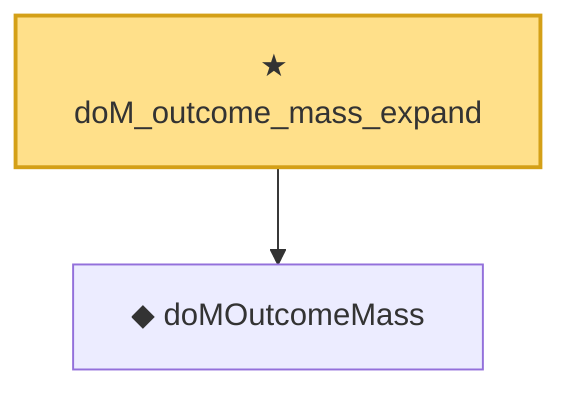

# Proof narrative — doM_outcome_mass_expand

Root: **doM_outcome_mass_expand** (theorem) `Statlib/Causal/SCM/Theorems.lean:1704` · topic `Causal`
Closure: 2 declarations across 2 files. Generated from `proof_graph.json` — no files were moved.

Reading order (foundations first, headline last):

  ◆ `doMOutcomeMass` — noncomputable def · `Statlib/Causal/SCM/Frontdoor.lean:70`  _(also used by 1: front_door_adjustment)_
★ `doM_outcome_mass_expand` — theorem · `Statlib/Causal/SCM/Theorems.lean:1704` **← headline**

## Dependency diagram

