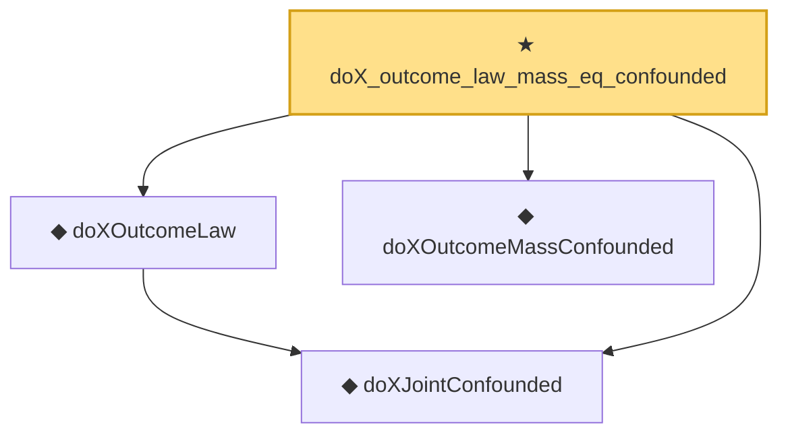

# Proof narrative — doX_outcome_law_mass_eq_confounded

Root: **doX_outcome_law_mass_eq_confounded** (theorem) `Statlib/Causal/SCM/Theorems.lean:1795` · topic `Causal`
Closure: 4 declarations across 2 files. Generated from `proof_graph.json` — no files were moved.

Reading order (foundations first, headline last):

  ◆ `doXJointConfounded` — noncomputable def · `Statlib/Causal/SCM/FrontdoorCriterion.lean:67`  _(also used by 3: front_door_doX_mediator_invariant, doX_outcome_law_frontdoor_adjustment, doX_outcome_confounder_marginal_invariant)_
  ◆ `doXOutcomeLaw` — noncomputable def · `Statlib/Causal/SCM/FrontdoorCriterion.lean:83`  _(also used by 1: doX_outcome_law_frontdoor_adjustment)_
  ◆ `doXOutcomeMassConfounded` — noncomputable def · `Statlib/Causal/SCM/FrontdoorCriterion.lean:74`  _(also used by 1: front_door_adjustment_confounded)_
★ `doX_outcome_law_mass_eq_confounded` — theorem · `Statlib/Causal/SCM/Theorems.lean:1795` **← headline**

## Dependency diagram

