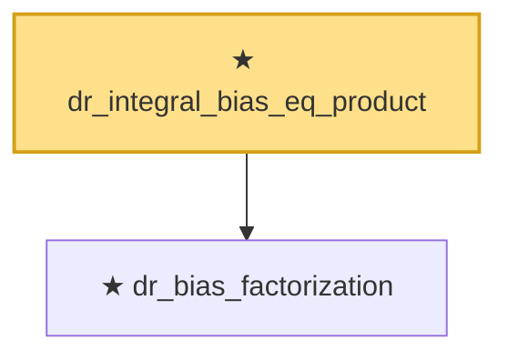

# Proof narrative — dr_integral_bias_eq_product

Root: **dr_integral_bias_eq_product** (theorem) `Statlib/Causal/OptimalTransport.lean:680` · topic `Causal`
Closure: 2 declarations across 1 files. Generated from `proof_graph.json` — no files were moved.

Reading order (foundations first, headline last):

  ★ `dr_bias_factorization` — theorem · `Statlib/Causal/OptimalTransport.lean:635`
★ `dr_integral_bias_eq_product` — theorem · `Statlib/Causal/OptimalTransport.lean:680` **← headline**

## Dependency diagram

