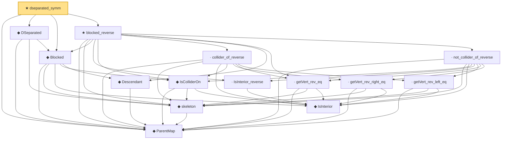

# Proof narrative — dseparated_symm

Root: **dseparated_symm** (theorem) `Statlib/Causal/SCM/Theorems.lean:1505` · topic `Causal`
Closure: 15 declarations across 3 files. Generated from `proof_graph.json` — no files were moved.

Reading order (foundations first, headline last):

  ◆ `ParentMap` — abbrev · `Statlib/Causal/SCM/Vocabulary.lean:36`  _(also used by 34: parentsIn, mem_parentsIn_iff, DependsOnlyOnParents, …)_
    ◆ `skeleton` — def · `Statlib/Causal/SCM/MoralizedGraph.lean:45`  _(also used by 5: BackDoorCriterion, skeleton_adj_iff, skeleton_edge_moralized, …)_
      ◆ `IsInterior` — def · `Statlib/Causal/SCM/MoralizedGraph.lean:87`
    ◆ `IsColliderOn` — def · `Statlib/Causal/SCM/MoralizedGraph.lean:93`
    ◆ `Descendant` — def · `Statlib/Causal/SCM/MoralizedGraph.lean:79`  _(also used by 3: BackDoorCriterion, descendant_rev_ancestor, backdoor_criterion_of_parents_subset)_
  ◆ `Blocked` — def · `Statlib/Causal/SCM/MoralizedGraph.lean:103`  _(also used by 3: BackDoorCriterion, backdoor_blocks_into_x_of_parents_subset, backdoor_no_active_backdoor_path)_
  ◆ `DSeparated` — def · `Statlib/Causal/SCM/MoralizedGraph.lean:113`  _(also used by 1: dseparated_mono_left)_
    · `IsInterior_reverse` — lemma · `Statlib/Causal/SCM/Theorems.lean:1408`
      · `getVert_rev_right_eq` — lemma · `Statlib/Causal/SCM/Theorems.lean:1437`
    · `getVert_rev_eq` — lemma · `Statlib/Causal/SCM/Theorems.lean:1418`
      · `getVert_rev_left_eq` — lemma · `Statlib/Causal/SCM/Theorems.lean:1427`
    · `collider_of_reverse` — lemma · `Statlib/Causal/SCM/Theorems.lean:1447`
    · `not_collider_of_reverse` — lemma · `Statlib/Causal/SCM/Theorems.lean:1465`
  ★ `blocked_reverse` — theorem · `Statlib/Causal/SCM/Theorems.lean:1484`
★ `dseparated_symm` — theorem · `Statlib/Causal/SCM/Theorems.lean:1505` **← headline**

## Dependency diagram

