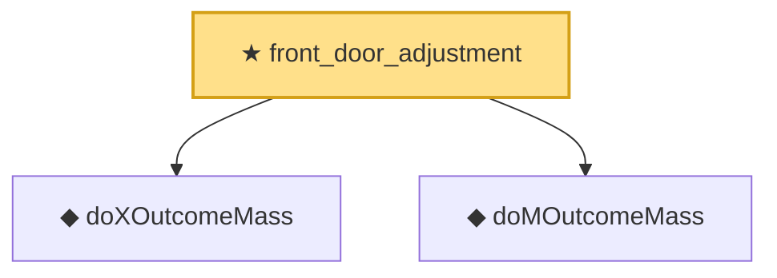

# Proof narrative — front_door_adjustment

Root: **front_door_adjustment** (theorem) `Statlib/Causal/SCM/Theorems.lean:1685` · topic `Causal`
Closure: 3 declarations across 2 files. Generated from `proof_graph.json` — no files were moved.

Reading order (foundations first, headline last):

  ◆ `doXOutcomeMass` — noncomputable def · `Statlib/Causal/SCM/Frontdoor.lean:61`
  ◆ `doMOutcomeMass` — noncomputable def · `Statlib/Causal/SCM/Frontdoor.lean:70`  _(also used by 1: doM_outcome_mass_expand)_
★ `front_door_adjustment` — theorem · `Statlib/Causal/SCM/Theorems.lean:1685` **← headline**

## Dependency diagram

