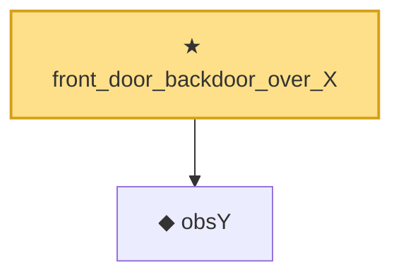

# Proof narrative — front_door_backdoor_over_X

Root: **front_door_backdoor_over_X** (theorem) `Statlib/Causal/SCM/Theorems.lean:1733` · topic `Causal`
Closure: 2 declarations across 2 files. Generated from `proof_graph.json` — no files were moved.

Reading order (foundations first, headline last):

  ◆ `obsY` — noncomputable def · `Statlib/Causal/SCM/FrontdoorCriterion.lean:58`  _(also used by 2: front_door_adjustment_confounded, doX_outcome_law_frontdoor_adjustment)_
★ `front_door_backdoor_over_X` — theorem · `Statlib/Causal/SCM/Theorems.lean:1733` **← headline**

## Dependency diagram

