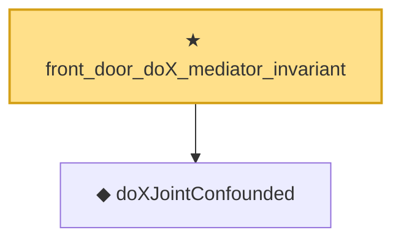

# Proof narrative — front_door_doX_mediator_invariant

Root: **front_door_doX_mediator_invariant** (theorem) `Statlib/Causal/SCM/Theorems.lean:1786` · topic `Causal`
Closure: 2 declarations across 2 files. Generated from `proof_graph.json` — no files were moved.

Reading order (foundations first, headline last):

  ◆ `doXJointConfounded` — noncomputable def · `Statlib/Causal/SCM/FrontdoorCriterion.lean:67`  _(also used by 4: doXOutcomeLaw, doX_outcome_law_mass_eq_confounded, doX_outcome_law_frontdoor_adjustment, …)_
★ `front_door_doX_mediator_invariant` — theorem · `Statlib/Causal/SCM/Theorems.lean:1786` **← headline**

## Dependency diagram

