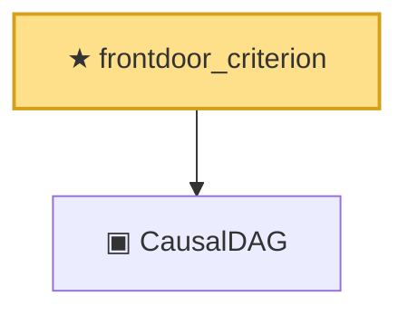

# Proof narrative — frontdoor_criterion

Root: **frontdoor_criterion** (theorem) `Statlib/Causal/DoCalculus.lean:216` · topic `Causal`
Closure: 2 declarations across 1 files. Generated from `proof_graph.json` — no files were moved.

Reading order (foundations first, headline last):

  ▣ `CausalDAG` — structure · `Statlib/Causal/DoCalculus.lean:43`  _(also used by 16: parents, descendants, ancestors, …)_
★ `frontdoor_criterion` — theorem · `Statlib/Causal/DoCalculus.lean:216` **← headline**

## Dependency diagram

