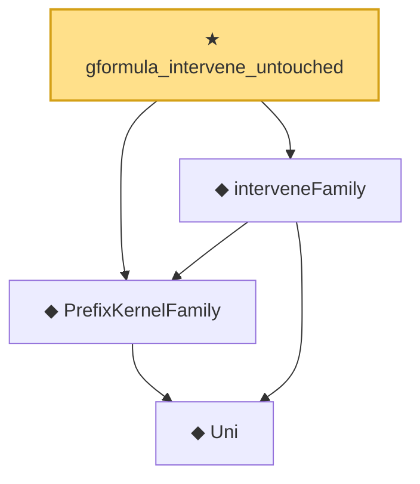

# Proof narrative — gformula_intervene_untouched

Root: **gformula_intervene_untouched** (theorem) `Statlib/Causal/SCM/Theorems.lean:225` · topic `Causal`
Closure: 4 declarations across 2 files. Generated from `proof_graph.json` — no files were moved.

Reading order (foundations first, headline last):

    ◆ `Uni` — abbrev · `Statlib/Causal/SCM/GFormula.lean:38`  _(also used by 14: uniM, gformulaJoint, parentProj, …)_
  ◆ `PrefixKernelFamily` — abbrev · `Statlib/Causal/SCM/GFormula.lean:50`  _(also used by 11: gformulaJoint, DependsOnlyOnParents, InducedPrefixFamily, …)_
  ◆ `interveneFamily` — noncomputable def · `Statlib/Causal/SCM/GFormula.lean:56`  _(also used by 7: gformula_pins_intervened, gformula_truncation, gformula_do_decomp, …)_
★ `gformula_intervene_untouched` — theorem · `Statlib/Causal/SCM/Theorems.lean:225` **← headline**

## Dependency diagram

