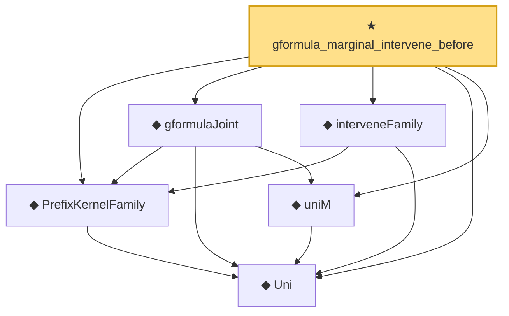

# Proof narrative — gformula_marginal_intervene_before

Root: **gformula_marginal_intervene_before** (theorem) `Statlib/Causal/SCM/Theorems.lean:562` · topic `Causal`
Closure: 6 declarations across 2 files. Generated from `proof_graph.json` — no files were moved.

Reading order (foundations first, headline last):

  ◆ `Uni` — abbrev · `Statlib/Causal/SCM/GFormula.lean:38`  _(also used by 11: parentProj, measurable_parentProj, DependsOnlyOnParents, …)_
  ◆ `PrefixKernelFamily` — abbrev · `Statlib/Causal/SCM/GFormula.lean:50`  _(also used by 10: DependsOnlyOnParents, InducedPrefixFamily, gformula_joint_markov, …)_
  ◆ `uniM` — noncomputable def · `Statlib/Causal/SCM/GFormula.lean:43`  _(also used by 4: gformula_pins_intervened, gformula_truncation, gformula_do_decomp, …)_
  ◆ `gformulaJoint` — noncomputable def · `Statlib/Causal/SCM/GFormula.lean:65`  _(also used by 6: gformula_joint_markov, gformula_pins_intervened, gformula_truncation, …)_
  ◆ `interveneFamily` — noncomputable def · `Statlib/Causal/SCM/GFormula.lean:56`  _(also used by 7: gformula_pins_intervened, gformula_intervene_untouched, gformula_truncation, …)_
★ `gformula_marginal_intervene_before` — theorem · `Statlib/Causal/SCM/Theorems.lean:562` **← headline**

## Dependency diagram

