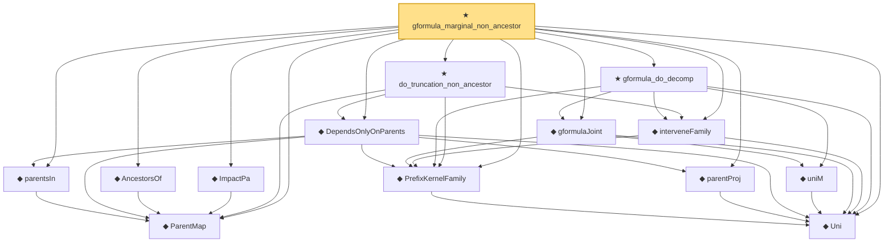

# Proof narrative — gformula_marginal_non_ancestor

Root: **gformula_marginal_non_ancestor** (theorem) `Statlib/Causal/SCM/Theorems.lean:696` · topic `Causal`
Closure: 14 declarations across 4 files. Generated from `proof_graph.json` — no files were moved.

Reading order (foundations first, headline last):

  ◆ `ParentMap` — abbrev · `Statlib/Causal/SCM/Vocabulary.lean:36`  _(also used by 40: mem_parentsIn_iff, skeleton, moralize, …)_
  ◆ `Uni` — abbrev · `Statlib/Causal/SCM/GFormula.lean:38`  _(also used by 8: measurable_parentProj, extendToAssignment, InducedPrefixFamily, …)_
  ◆ `PrefixKernelFamily` — abbrev · `Statlib/Causal/SCM/GFormula.lean:50`  _(also used by 7: InducedPrefixFamily, gformula_joint_markov, gformula_pins_intervened, …)_
  ◆ `parentsIn` — noncomputable def · `Statlib/Causal/SCM/GFormulaGraph.lean:48`  _(also used by 2: mem_parentsIn_iff, parents_precede_in_topological_order)_
  ◆ `parentProj` — noncomputable def · `Statlib/Causal/SCM/GFormulaGraph.lean:63`  _(also used by 1: measurable_parentProj)_
  ◆ `DependsOnlyOnParents` — def · `Statlib/Causal/SCM/GFormulaGraph.lean:82`
  ◆ `AncestorsOf` — def · `Statlib/Causal/SCM/GFormulaGraph.lean:90`  _(also used by 7: acyclic_no_self_ancestor, ancestors_strictly_below, parent_mem_ancestors, …)_
  ◆ `ImpactPa` — def · `Statlib/Causal/SCM/GFormulaGraph.lean:101`
    ◆ `uniM` — noncomputable def · `Statlib/Causal/SCM/GFormula.lean:43`  _(also used by 4: gformula_pins_intervened, gformula_truncation, gformula_marginal_prefix, …)_
  ◆ `gformulaJoint` — noncomputable def · `Statlib/Causal/SCM/GFormula.lean:65`  _(also used by 5: gformula_joint_markov, gformula_pins_intervened, gformula_truncation, …)_
  ◆ `interveneFamily` — noncomputable def · `Statlib/Causal/SCM/GFormula.lean:56`  _(also used by 5: gformula_pins_intervened, gformula_intervene_untouched, gformula_truncation, …)_
  ★ `gformula_do_decomp` — theorem · `Statlib/Causal/SCM/Theorems.lean:295`
  ★ `do_truncation_non_ancestor` — theorem · `Statlib/Causal/SCM/Theorems.lean:410`
★ `gformula_marginal_non_ancestor` — theorem · `Statlib/Causal/SCM/Theorems.lean:696` **← headline**

## Dependency diagram

