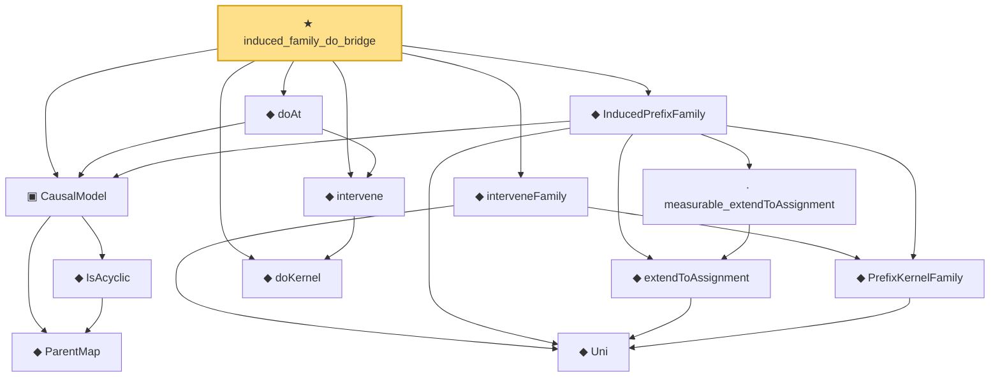

# Proof narrative — induced_family_do_bridge

Root: **induced_family_do_bridge** (theorem) `Statlib/Causal/SCM/Theorems.lean:465` · topic `Causal`
Closure: 13 declarations across 4 files. Generated from `proof_graph.json` — no files were moved.

Reading order (foundations first, headline last):

    ◆ `ParentMap` — abbrev · `Statlib/Causal/SCM/Vocabulary.lean:36`  _(also used by 44: parentsIn, mem_parentsIn_iff, DependsOnlyOnParents, …)_
    ◆ `IsAcyclic` — def · `Statlib/Causal/SCM/Vocabulary.lean:42`  _(also used by 6: acyclic_of_topological_order, acyclic_no_self_loop, acyclic_no_self_ancestor, …)_
  ▣ `CausalModel` — structure · `Statlib/Causal/SCM/Vocabulary.lean:76`  _(also used by 1: doAt_preserves_pa)_
    ◆ `Uni` — abbrev · `Statlib/Causal/SCM/GFormula.lean:38`  _(also used by 12: uniM, gformulaJoint, parentProj, …)_
    ◆ `PrefixKernelFamily` — abbrev · `Statlib/Causal/SCM/GFormula.lean:50`  _(also used by 11: gformulaJoint, DependsOnlyOnParents, gformula_joint_markov, …)_
    ◆ `extendToAssignment` — noncomputable def · `Statlib/Causal/SCM/GFormulaGraph.lean:108`
    · `measurable_extendToAssignment` — lemma · `Statlib/Causal/SCM/GFormulaGraph.lean:113`
  ◆ `InducedPrefixFamily` — noncomputable def · `Statlib/Causal/SCM/GFormulaGraph.lean:127`
  ◆ `doKernel` — noncomputable def · `Statlib/Causal/SCM/Vocabulary.lean:64`  _(also used by 1: intervene_self)_
  ◆ `intervene` — noncomputable def · `Statlib/Causal/SCM/Vocabulary.lean:68`  _(also used by 3: intervene_ne, intervene_self, intervene_commutes_disjoint)_
  ◆ `doAt` — noncomputable def · `Statlib/Causal/SCM/Vocabulary.lean:86`  _(also used by 1: doAt_preserves_pa)_
  ◆ `interveneFamily` — noncomputable def · `Statlib/Causal/SCM/GFormula.lean:56`  _(also used by 7: gformula_pins_intervened, gformula_intervene_untouched, gformula_truncation, …)_
★ `induced_family_do_bridge` — theorem · `Statlib/Causal/SCM/Theorems.lean:465` **← headline**

## Dependency diagram

