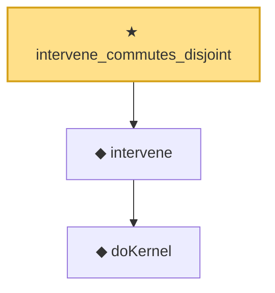

# Proof narrative — intervene_commutes_disjoint

Root: **intervene_commutes_disjoint** (theorem) `Statlib/Causal/SCM/Theorems.lean:385` · topic `Causal`
Closure: 3 declarations across 2 files. Generated from `proof_graph.json` — no files were moved.

Reading order (foundations first, headline last):

    ◆ `doKernel` — noncomputable def · `Statlib/Causal/SCM/Vocabulary.lean:64`  _(also used by 2: intervene_self, induced_family_do_bridge)_
  ◆ `intervene` — noncomputable def · `Statlib/Causal/SCM/Vocabulary.lean:68`  _(also used by 4: intervene_ne, intervene_self, induced_family_do_bridge, …)_
★ `intervene_commutes_disjoint` — theorem · `Statlib/Causal/SCM/Theorems.lean:385` **← headline**

## Dependency diagram

