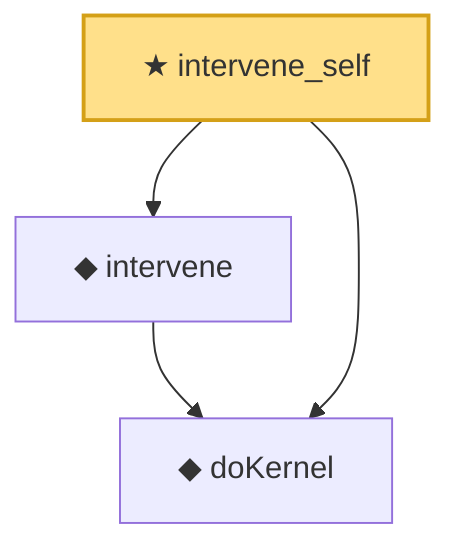

# Proof narrative — intervene_self

Root: **intervene_self** (theorem) `Statlib/Causal/SCM/Theorems.lean:90` · topic `Causal`
Closure: 3 declarations across 2 files. Generated from `proof_graph.json` — no files were moved.

Reading order (foundations first, headline last):

  ◆ `doKernel` — noncomputable def · `Statlib/Causal/SCM/Vocabulary.lean:64`  _(also used by 1: induced_family_do_bridge)_
  ◆ `intervene` — noncomputable def · `Statlib/Causal/SCM/Vocabulary.lean:68`  _(also used by 4: intervene_ne, intervene_commutes_disjoint, induced_family_do_bridge, …)_
★ `intervene_self` — theorem · `Statlib/Causal/SCM/Theorems.lean:90` **← headline**

## Dependency diagram

