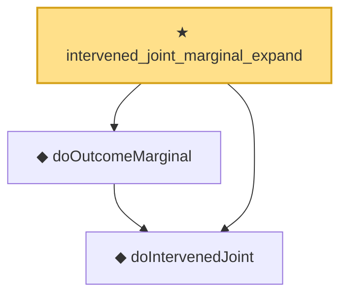

# Proof narrative — intervened_joint_marginal_expand

Root: **intervened_joint_marginal_expand** (theorem) `Statlib/Causal/SCM/Theorems.lean:1639` · topic `Causal`
Closure: 3 declarations across 2 files. Generated from `proof_graph.json` — no files were moved.

Reading order (foundations first, headline last):

  ◆ `doIntervenedJoint` — noncomputable def · `Statlib/Causal/SCM/Backdoor.lean:50`  _(also used by 1: backdoor_adjustment)_
  ◆ `doOutcomeMarginal` — noncomputable def · `Statlib/Causal/SCM/Backdoor.lean:56`  _(also used by 1: backdoor_adjustment)_
★ `intervened_joint_marginal_expand` — theorem · `Statlib/Causal/SCM/Theorems.lean:1639` **← headline**

## Dependency diagram

