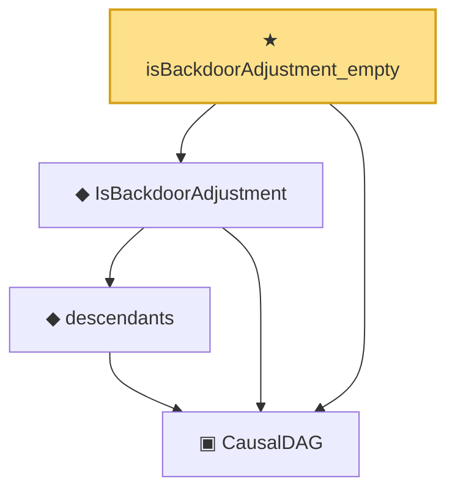

# Proof narrative — isBackdoorAdjustment_empty

Root: **isBackdoorAdjustment_empty** (theorem) `Statlib/Causal/DoCalculus.lean:174` · topic `Causal`
Closure: 4 declarations across 1 files. Generated from `proof_graph.json` — no files were moved.

Reading order (foundations first, headline last):

  ▣ `CausalDAG` — structure · `Statlib/Causal/DoCalculus.lean:43`  _(also used by 14: parents, ancestors, no_self_edge, …)_
    ◆ `descendants` — def · `Statlib/Causal/DoCalculus.lean:59`  _(also used by 2: not_self_descendant, mem_descendants_of_edge)_
  ◆ `IsBackdoorAdjustment` — def · `Statlib/Causal/DoCalculus.lean:168`
★ `isBackdoorAdjustment_empty` — theorem · `Statlib/Causal/DoCalculus.lean:174` **← headline**

## Dependency diagram

