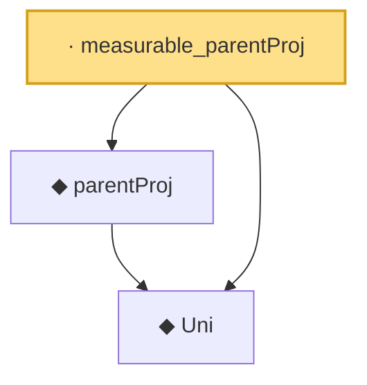

# Proof narrative — measurable_parentProj

Root: **measurable_parentProj** (lemma) `Statlib/Causal/SCM/GFormulaGraph.lean:68` · topic `Causal`
Closure: 3 declarations across 2 files. Generated from `proof_graph.json` — no files were moved.

Reading order (foundations first, headline last):

  ◆ `Uni` — abbrev · `Statlib/Causal/SCM/GFormula.lean:38`  _(also used by 14: uniM, PrefixKernelFamily, interveneFamily, …)_
  ◆ `parentProj` — noncomputable def · `Statlib/Causal/SCM/GFormulaGraph.lean:63`  _(also used by 2: DependsOnlyOnParents, gformula_marginal_non_ancestor)_
· `measurable_parentProj` — lemma · `Statlib/Causal/SCM/GFormulaGraph.lean:68` **← headline**

## Dependency diagram

