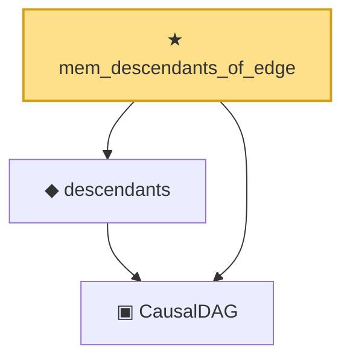

# Proof narrative — mem_descendants_of_edge

Root: **mem_descendants_of_edge** (theorem) `Statlib/Causal/DoCalculus.lean:87` · topic `Causal`
Closure: 3 declarations across 1 files. Generated from `proof_graph.json` — no files were moved.

Reading order (foundations first, headline last):

  ▣ `CausalDAG` — structure · `Statlib/Causal/DoCalculus.lean:43`  _(also used by 15: parents, ancestors, no_self_edge, …)_
  ◆ `descendants` — def · `Statlib/Causal/DoCalculus.lean:59`  _(also used by 2: not_self_descendant, IsBackdoorAdjustment)_
★ `mem_descendants_of_edge` — theorem · `Statlib/Causal/DoCalculus.lean:87` **← headline**

## Dependency diagram

