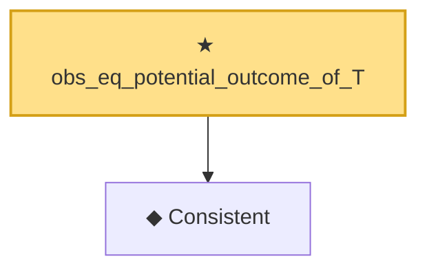

# Proof narrative — obs_eq_potential_outcome_of_T

Root: **obs_eq_potential_outcome_of_T** (theorem) `Statlib/Causal/Identification.lean:41` · topic `Causal`
Closure: 2 declarations across 2 files. Generated from `proof_graph.json` — no files were moved.

Reading order (foundations first, headline last):

  ◆ `Consistent` — def · `Statlib/Causal/Vocabulary.lean:44`  _(also used by 3: ate_y1_eq, ate_diff_eq, ate_y1_eq_by_propensity)_
★ `obs_eq_potential_outcome_of_T` — theorem · `Statlib/Causal/Identification.lean:41` **← headline**

## Dependency diagram

