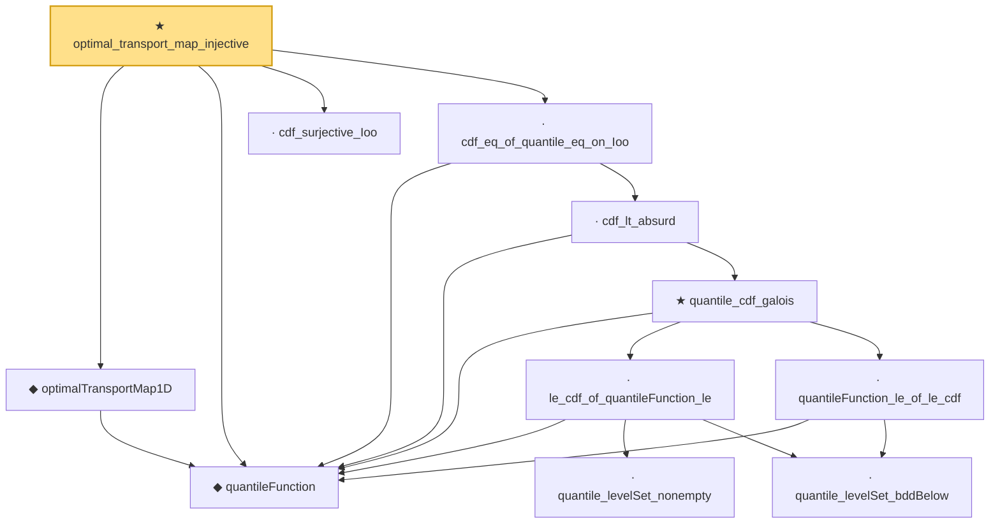

# Proof narrative — optimal_transport_map_injective

Root: **optimal_transport_map_injective** (theorem) `Statlib/Causal/OptimalTransport.lean:220` · topic `Causal`
Closure: 11 declarations across 1 files. Generated from `proof_graph.json` — no files were moved.

Reading order (foundations first, headline last):

  ◆ `quantileFunction` — noncomputable def · `Statlib/Causal/OptimalTransport.lean:34`  _(also used by 12: quantileFunction_mono, wasserstein_sq_eq_quantile_integral, individualCausalEffectMap, …)_
  ◆ `optimalTransportMap1D` — noncomputable def · `Statlib/Causal/OptimalTransport.lean:136`  _(also used by 2: causalTransportMap, averageCausalEffectMap_ref_mu0)_
  · `cdf_surjective_Ioo` — private lemma · `Statlib/Causal/OptimalTransport.lean:155`
          · `quantile_levelSet_nonempty` — private lemma · `Statlib/Causal/OptimalTransport.lean:38`  _(also used by 1: quantileFunction_mono)_
          · `quantile_levelSet_bddBelow` — private lemma · `Statlib/Causal/OptimalTransport.lean:48`  _(also used by 1: quantileFunction_mono)_
        · `le_cdf_of_quantileFunction_le` — lemma · `Statlib/Causal/OptimalTransport.lean:76`
        · `quantileFunction_le_of_le_cdf` — lemma · `Statlib/Causal/OptimalTransport.lean:69`
      ★ `quantile_cdf_galois` — theorem · `Statlib/Causal/OptimalTransport.lean:122`
    · `cdf_lt_absurd` — private lemma · `Statlib/Causal/OptimalTransport.lean:185`
  · `cdf_eq_of_quantile_eq_on_Ioo` — private lemma · `Statlib/Causal/OptimalTransport.lean:203`
★ `optimal_transport_map_injective` — theorem · `Statlib/Causal/OptimalTransport.lean:220` **← headline**

## Dependency diagram

