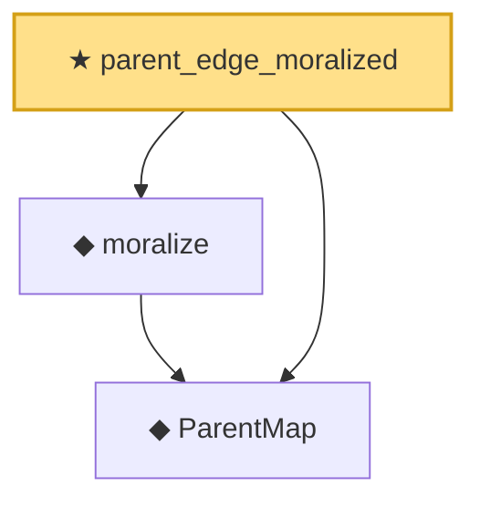

# Proof narrative — parent_edge_moralized

Root: **parent_edge_moralized** (theorem) `Statlib/Causal/SCM/Theorems.lean:1356` · topic `Causal`
Closure: 3 declarations across 3 files. Generated from `proof_graph.json` — no files were moved.

Reading order (foundations first, headline last):

  ◆ `ParentMap` — abbrev · `Statlib/Causal/SCM/Vocabulary.lean:36`  _(also used by 44: parentsIn, mem_parentsIn_iff, DependsOnlyOnParents, …)_
  ◆ `moralize` — def · `Statlib/Causal/SCM/MoralizedGraph.lean:60`  _(also used by 4: moralize_adj_iff, skeleton_edge_moralized, coparents_moralized, …)_
★ `parent_edge_moralized` — theorem · `Statlib/Causal/SCM/Theorems.lean:1356` **← headline**

## Dependency diagram

