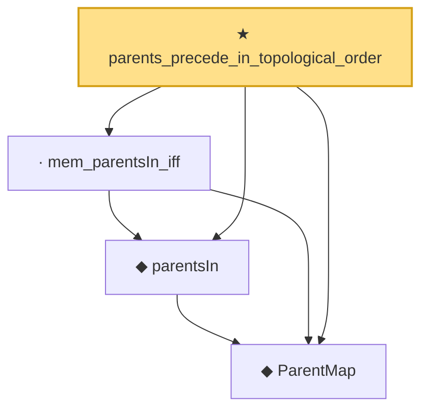

# Proof narrative — parents_precede_in_topological_order

Root: **parents_precede_in_topological_order** (theorem) `Statlib/Causal/SCM/Theorems.lean:375` · topic `Causal`
Closure: 4 declarations across 3 files. Generated from `proof_graph.json` — no files were moved.

Reading order (foundations first, headline last):

  ◆ `ParentMap` — abbrev · `Statlib/Causal/SCM/Vocabulary.lean:36`  _(also used by 43: DependsOnlyOnParents, AncestorsOf, ImpactPa, …)_
  ◆ `parentsIn` — noncomputable def · `Statlib/Causal/SCM/GFormulaGraph.lean:48`  _(also used by 2: DependsOnlyOnParents, gformula_marginal_non_ancestor)_
  · `mem_parentsIn_iff` — lemma · `Statlib/Causal/SCM/GFormulaGraph.lean:53`
★ `parents_precede_in_topological_order` — theorem · `Statlib/Causal/SCM/Theorems.lean:375` **← headline**

## Dependency diagram

