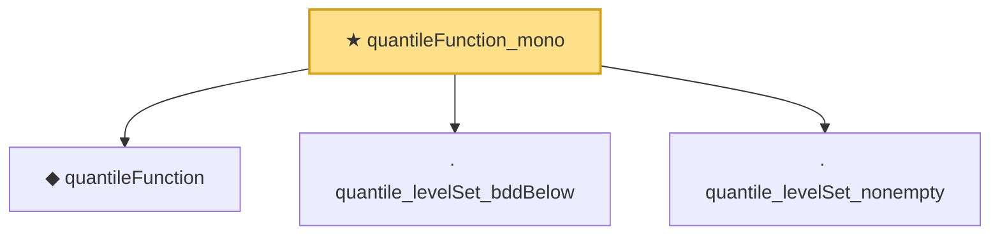

# Proof narrative — quantileFunction_mono

Root: **quantileFunction_mono** (theorem) `Statlib/Causal/OptimalTransport.lean:60` · topic `Causal`
Closure: 4 declarations across 1 files. Generated from `proof_graph.json` — no files were moved.

Reading order (foundations first, headline last):

  ◆ `quantileFunction` — noncomputable def · `Statlib/Causal/OptimalTransport.lean:34`  _(also used by 18: quantileFunction_le_of_le_cdf, le_cdf_of_quantileFunction_le, quantile_cdf_galois, …)_
  · `quantile_levelSet_bddBelow` — private lemma · `Statlib/Causal/OptimalTransport.lean:48`  _(also used by 2: quantileFunction_le_of_le_cdf, le_cdf_of_quantileFunction_le)_
  · `quantile_levelSet_nonempty` — private lemma · `Statlib/Causal/OptimalTransport.lean:38`  _(also used by 1: le_cdf_of_quantileFunction_le)_
★ `quantileFunction_mono` — theorem · `Statlib/Causal/OptimalTransport.lean:60` **← headline**

## Dependency diagram

