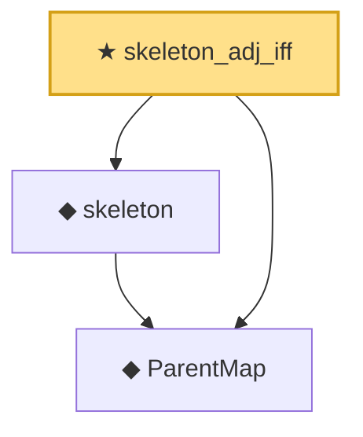

# Proof narrative — skeleton_adj_iff

Root: **skeleton_adj_iff** (theorem) `Statlib/Causal/SCM/Theorems.lean:1344` · topic `Causal`
Closure: 3 declarations across 3 files. Generated from `proof_graph.json` — no files were moved.

Reading order (foundations first, headline last):

  ◆ `ParentMap` — abbrev · `Statlib/Causal/SCM/Vocabulary.lean:36`  _(also used by 44: parentsIn, mem_parentsIn_iff, DependsOnlyOnParents, …)_
  ◆ `skeleton` — def · `Statlib/Causal/SCM/MoralizedGraph.lean:45`  _(also used by 13: IsColliderOn, Blocked, DSeparated, …)_
★ `skeleton_adj_iff` — theorem · `Statlib/Causal/SCM/Theorems.lean:1344` **← headline**

## Dependency diagram

