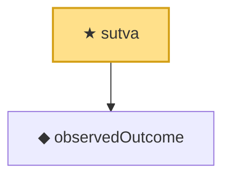

# Proof narrative — sutva

Root: **sutva** (theorem) `Statlib/Causal/Basic.lean:122` · topic `Causal`
Closure: 2 declarations across 1 files. Generated from `proof_graph.json` — no files were moved.

Reading order (foundations first, headline last):

  ◆ `observedOutcome` — def · `Statlib/Causal/Basic.lean:117`  _(also used by 1: causalEffectMap_identification)_
★ `sutva` — theorem · `Statlib/Causal/Basic.lean:122` **← headline**

## Dependency diagram

