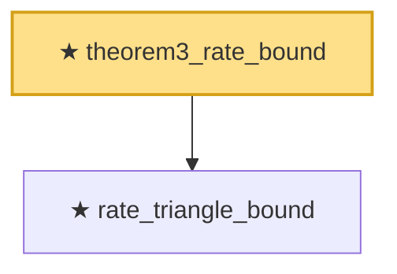

# Proof narrative — theorem3_rate_bound

Root: **theorem3_rate_bound** (theorem) `Statlib/Causal/OptimalTransport.lean:910` · topic `Causal`
Closure: 2 declarations across 1 files. Generated from `proof_graph.json` — no files were moved.

Reading order (foundations first, headline last):

  ★ `rate_triangle_bound` — theorem · `Statlib/Causal/OptimalTransport.lean:810`
★ `theorem3_rate_bound` — theorem · `Statlib/Causal/OptimalTransport.lean:910` **← headline**

## Dependency diagram

