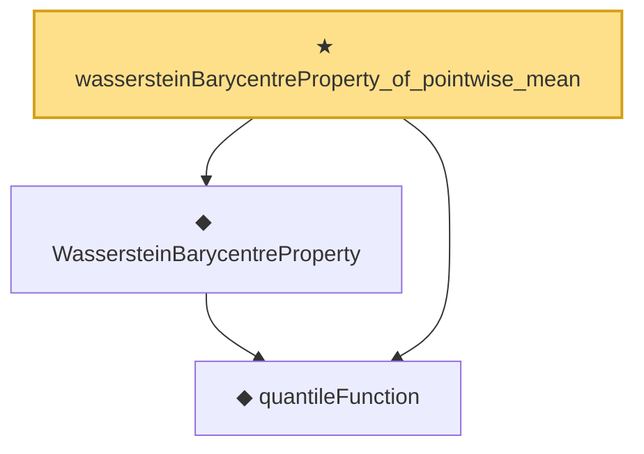

# Proof narrative — wassersteinBarycentreProperty_of_pointwise_mean

Root: **wassersteinBarycentreProperty_of_pointwise_mean** (theorem) `Statlib/Causal/OptimalTransport.lean:407` · topic `Causal`
Closure: 3 declarations across 1 files. Generated from `proof_graph.json` — no files were moved.

Reading order (foundations first, headline last):

  ◆ `quantileFunction` — noncomputable def · `Statlib/Causal/OptimalTransport.lean:34`  _(also used by 17: quantileFunction_mono, quantileFunction_le_of_le_cdf, le_cdf_of_quantileFunction_le, …)_
  ◆ `WassersteinBarycentreProperty` — def · `Statlib/Causal/OptimalTransport.lean:367`  _(also used by 2: causalEffectMap_eq_expectation, causalEffectMap_identification)_
★ `wassersteinBarycentreProperty_of_pointwise_mean` — theorem · `Statlib/Causal/OptimalTransport.lean:407` **← headline**

## Dependency diagram

