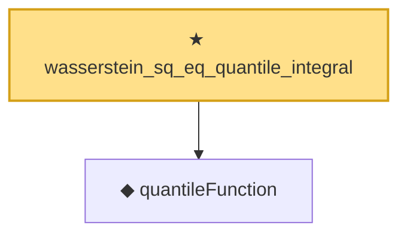

# Proof narrative — wasserstein_sq_eq_quantile_integral

Root: **wasserstein_sq_eq_quantile_integral** (theorem) `Statlib/Causal/OptimalTransport.lean:144` · topic `Causal`
Closure: 2 declarations across 1 files. Generated from `proof_graph.json` — no files were moved.

Reading order (foundations first, headline last):

  ◆ `quantileFunction` — noncomputable def · `Statlib/Causal/OptimalTransport.lean:34`  _(also used by 18: quantileFunction_mono, quantileFunction_le_of_le_cdf, le_cdf_of_quantileFunction_le, …)_
★ `wasserstein_sq_eq_quantile_integral` — theorem · `Statlib/Causal/OptimalTransport.lean:144` **← headline**

## Dependency diagram

