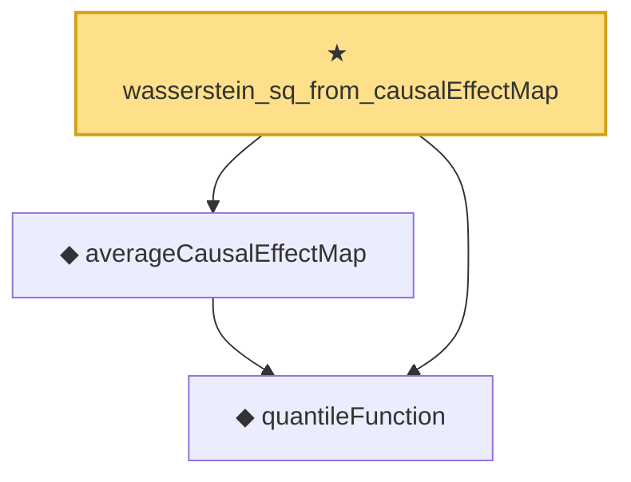

# Proof narrative — wasserstein_sq_from_causalEffectMap

Root: **wasserstein_sq_from_causalEffectMap** (theorem) `Statlib/Causal/OptimalTransport.lean:541` · topic `Causal`
Closure: 3 declarations across 1 files. Generated from `proof_graph.json` — no files were moved.

Reading order (foundations first, headline last):

  ◆ `quantileFunction` — noncomputable def · `Statlib/Causal/OptimalTransport.lean:34`  _(also used by 17: quantileFunction_mono, quantileFunction_le_of_le_cdf, le_cdf_of_quantileFunction_le, …)_
  ◆ `averageCausalEffectMap` — noncomputable def · `Statlib/Causal/OptimalTransport.lean:269`  _(also used by 6: averageCausalEffectMap_eq_quantile_diff, averageCausalEffectMap_eq_zero_of_eq, averageCausalEffectMap_ref_mu0, …)_
★ `wasserstein_sq_from_causalEffectMap` — theorem · `Statlib/Causal/OptimalTransport.lean:541` **← headline**

## Dependency diagram

